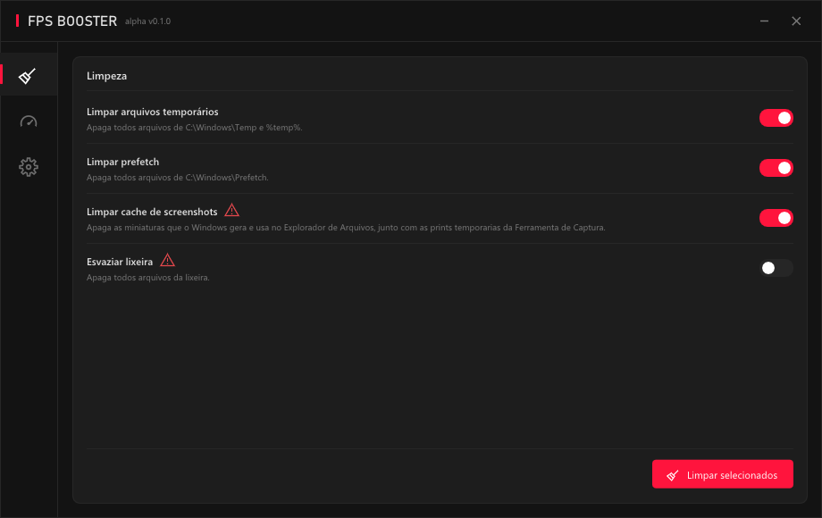
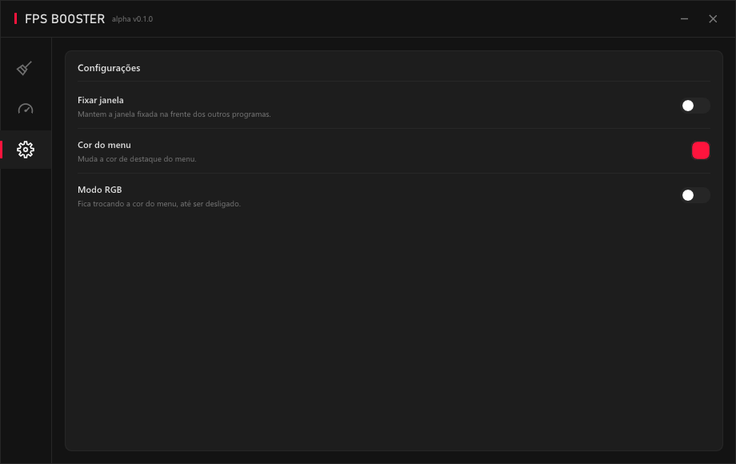

<div align="center">

# FPS Booster

**Otimizador de PC para Windows, escrito em C++.**




</div>

## Sobre

O FPS Booster é uma ferramenta para limpar arquivos que o Windows acumula durante o uso, 
incluindo arquivos temporários, Prefetch e cache de miniaturas e screenshots.

O projeto foi desenvolvido com foco em baixo consumo de recursos. O objetivo é manter o programa 
praticamente imperceptível enquanto estiver em execução, com uso mínimo de memória, CPU e GPU. 
Quando minimizado, o consumo de memória fica em torno de 3 MB, enquanto CPU e GPU permanecem em 0%.

<div align="center">

</div>

## Funcionalidades

### Limpeza

| Função | O que faz |
|---|---|
| **Limpar arquivos temporários** | Apaga os arquivos de `C:\Windows\Temp` e `%temp%`. |
| **Limpar prefetch** | Apaga os arquivos de `C:\Windows\Prefetch`. |
| **Limpar cache de screenshots** | Apaga as miniaturas do Explorador de Arquivos e as capturas temporárias da Ferramenta de Captura. |
| **Esvaziar lixeira** | Esvazia a Lixeira do Windows. |

Você marca o que quer limpar e clica em **Limpar selecionados**. No fim aparece
quantos itens foram apagados, quanto espaço foi liberado e quantos estavam em uso.

### Configurações

- **Fixar janela**: fixa na frente dos outros programas.
- **Cor do menu** com seletor de cor: muda a cor de destaque padrão do menu.
- **Modo RGB**: a cor do menu passa por todas as cores até ser desativada.

## Como usar?

### Baixe o projeto

Faça o download em [Releases](https://github.com/gabrielstanlay/fps-booster/releases/) e execute o programa.

> **O programa pede permissão de administrador toda vez que abre.** Sem isso o
> Windows não deixa apagar nada dentro de `C:\Windows\Temp` nem do `Prefetch`.
> Ao limpar o cache de screenshots, a barra de tarefas pisca por um instante. Isso
>é normal: o Explorador de Arquivos mantém esses arquivos abertos, então ele é
>fechado e reaberto durante a limpeza.

## Como compilar?

### 1. Pré-requisitos

Windows 10 ou 11 (64 bits) e o compilador da Microsoft. Se você ainda não tem,
instale o [Visual Studio Build Tools](https://visualstudio.microsoft.com/pt-br/downloads/)
(ou o Visual Studio Community) marcando a carga de trabalho
**Desenvolvimento para desktop com C++**.

Nada mais precisa ser instalado: o Dear ImGui já vem junto no repositório.

### 2. Baixar o projeto

```bash
git clone https://github.com/gabrielstanlay/fps-booster
```

Ou baixe o ZIP em **Code → Download ZIP** e extraia.

### 3. Compilar

Dê dois cliques em **`build.bat`**.

O script acha o compilador sozinho, compila tudo e pergunta se você quer abrir o
programa. O executável fica em `build\fpsbooster.exe`.

### Problemas comuns

| Mensagem | O que fazer |
|---|---|
| `Nao encontrei o compilador MSVC` | Instale os Build Tools com a carga de trabalho de C++ e rode o `build.bat` de novo. |
| `LNK1104: não é possível abrir o arquivo build\fpsbooster.exe` | O programa está aberto. Feche e compile de novo. |

## Estrutura do projeto

```
.
├── src/
│   ├── main.cpp        janela Win32, Direct3D 11 e loop principal
│   ├── menu.h/.cpp     toda a interface: tabs, painéis, widgets e cores
│   ├── theme.h/.cpp    paleta de cores e estilo do ImGui
│   ├── icons.h/.cpp    ícones desenhados em vetor
│   ├── cleaner.h/.cpp  funções de limpeza e a thread que roda elas
│   ├── app.manifest    compatibilidade de versão do Windows
│   └── version.rc      nome e versão que o Windows mostra no arquivo
├── backends/           backends do Dear ImGui (Win32 + DirectX 11)
├── build.bat           compila o projeto
└── assets/             imagens deste README
```

Para mudar a aparência, o bloco de cores fica no começo da função `initMenu`, no
fim do `src/menu.cpp`, com um comentário em cada linha dizendo o que ela pinta.

## Tecnologias

- **C++17** com a biblioteca padrão para o sistema de arquivos e as threads
- **Win32** para a janela sem borda e o acesso ao sistema
- **DirectX 11** para renderizar
- **[Dear ImGui](https://github.com/ocornut/imgui) 1.92.9b** para a interface

## Roadmap

- [x] Limpeza de temporários, Prefetch e cache de miniaturas
- [x] Personalização de cor e modo RGB
- [ ] Aba de otimizações
- [ ] Nova interface

## Licença

O Dear ImGui é distribuído sob a licença MIT, e o aviso original está em
[`LICENSE.txt`](LICENSE.txt).
